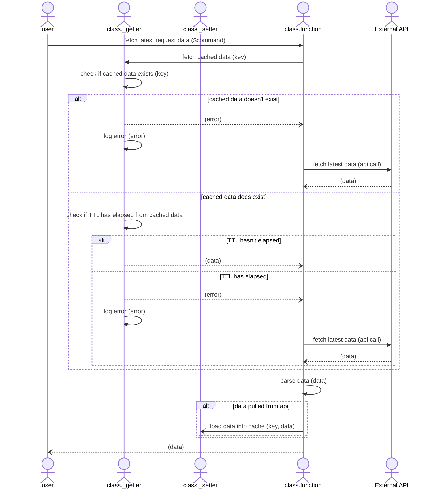

<!-- markdownlint-disable-file -->

```mermaid
sequenceDiagram
actor user
actor gc as class._getter
actor sc as class._setter
actor api as class.function
actor eapi as External API

user ->> api: fetch latest request data ($command)
api ->> gc: fetch cached data (key)
gc ->> gc: check if cached data exists (key)
alt cached data doesn't exist
    gc --) api: (error)
    gc ->> gc: log error (error)
    api ->> eapi: fetch latest data (api call)
    eapi --) api: (data)
else cached data does exist
    gc ->> gc: check if TTL has elapsed from cached data
    alt TTL hasn't elapsed
        gc --) api: (data)
    else TTL has elapsed
        gc --) api: (error)
        gc ->> gc: log error (error)
        api ->> eapi: fetch latest data (api call)
        eapi --) api: (data)
    end
end
api ->> api: parse data (data)
alt data pulled from api
    api -) sc: load data into cache (key, data)
else
end
api --) user: (data)
```
