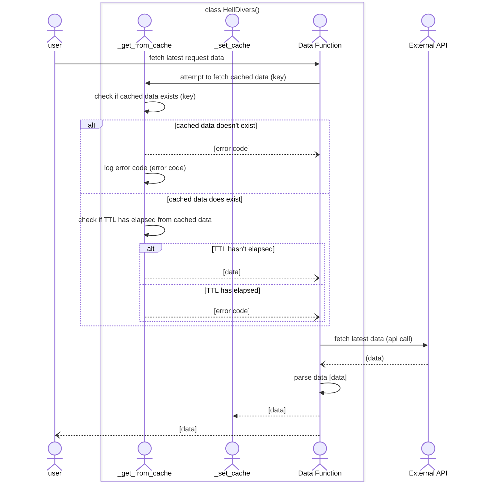

<!-- markdownlint-disable-file -->

```mermaid
sequenceDiagram
actor user
box transparent class HellDivers()
actor gc as _get_from_cache
actor sc as _set_cache
actor api as  Data Function
end
actor eapi as External API

user ->> api: fetch latest request data
api ->> gc: attempt to fetch cached data (key)
gc ->> gc: check if cached data exists (key)
alt cached data doesn't exist
    gc --) api: [error code]
    gc ->> gc: log error code (error code)
else cached data does exist
    gc ->> gc: check if TTL has elapsed from cached data
    alt TTL hasn't elapsed
        gc --) api: [data]
    else TTL has elapsed
        gc --) api: [error code]
    end
end
api ->> eapi: fetch latest data (api call)
eapi --) api: (data)
api ->> api: parse data [data]
api -->> sc: [data]
api --) user: [data]
```
