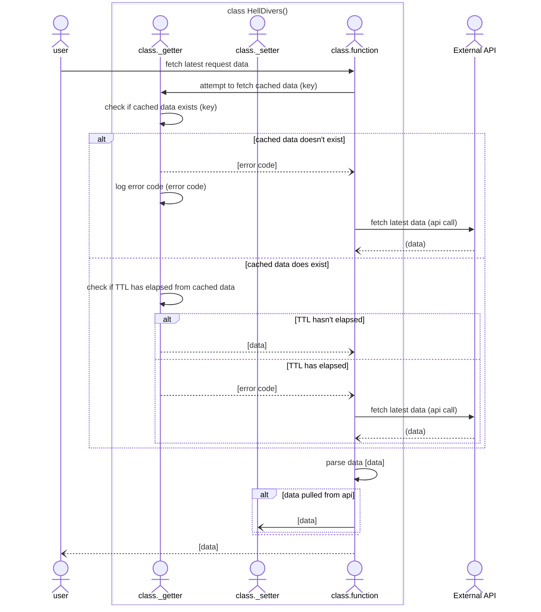

<!-- markdownlint-disable-file -->

```mermaid
sequenceDiagram
actor user
box transparent class HellDivers()
actor gc as class._getter
actor sc as class._setter
actor api as class.function
end
actor eapi as External API

user ->> api: fetch latest request data
api ->> gc: attempt to fetch cached data (key)
gc ->> gc: check if cached data exists (key)
alt cached data doesn't exist
    gc --) api: [error code]
    gc ->> gc: log error code (error code)
    api ->> eapi: fetch latest data (api call)
    eapi --) api: (data)
else cached data does exist
    gc ->> gc: check if TTL has elapsed from cached data
    alt TTL hasn't elapsed
        gc --) api: [data]
    else TTL has elapsed
        gc --) api: [error code]
        api ->> eapi: fetch latest data (api call)
        eapi --) api: (data)
    end
end
api ->> api: parse data [data]
alt data pulled from api
    api -) sc: [data]
else
end
api --) user: [data]
```
