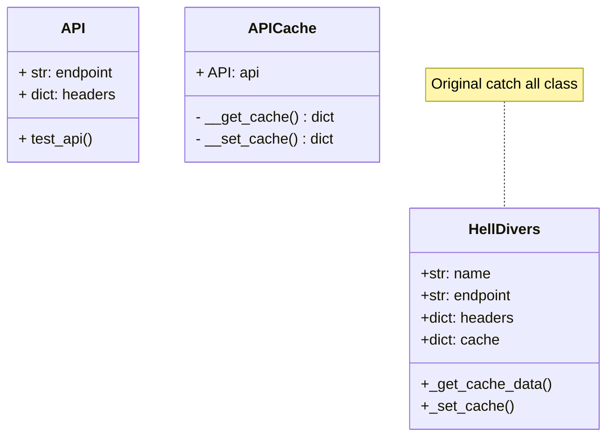

<!-- markdownlint-disable-file -->

```mermaid
classDiagram
    note for HellDivers "Original catch all class"

    class HellDivers {
        +str: name
        +str: endpoint
        +dict: headers
        +dict: cache
        +_get_cache_data()
        +_set_cache()
    }

    class API {
        + str: endpoint
        + dict: headers
        + test_api()
    }

    class APICache {
        + API: api
        - __get_cache() dict
        - __set_cache() dict
    }
```
